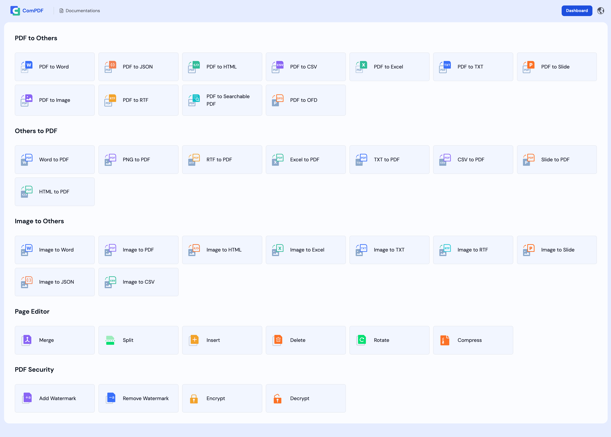
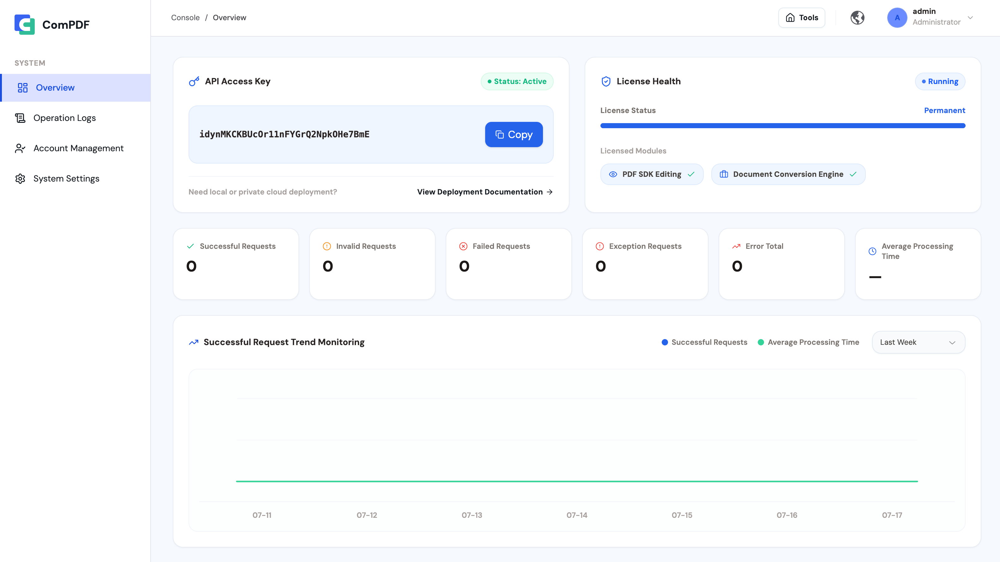

[English](README.md) | [繁體中文](README_TW.md) | [简体中文](README_CN.md)

# ComPDF Self-Hosted — Open Source PDF Editor & PDF Converter

Part of the KDAN ecosystem, [ComPDF Self-Hosted](https://www.compdf.com/self-hosted-deployment?utm_source=github_ai_selfhosted_newopen_en&utm_medium=referral&utm_campaign=github_ai_selfhosted_newopen_en&ref_platform_id=github_compdf) offers PDF editing and document conversion, helping teams process PDFs, Office files, and images securely in private Docker deployments.


> * If you find ComPDF Self-Hosted useful, please consider giving us a ⭐ **Star** on GitHub. It helps us grow and improve.
> * Got questions or ideas? Join the conversation in our [Discussions](https://github.com/ComPDF/compdf-self-hosted/discussions).

<p align="center">
  <a href="#"></a>
  <a href="#"></a>
  <a href="#"></a>
  <a href="#"></a>
</p>

<p align="center">
    <a href="#features"><b>Features</b></a> •
  <a href="#quick-start"><b>Quick Start</b></a> •
  <a href="#architecture"><b>Architecture</b></a> •
  <a href="#upgrade-to-enterprise"><b>Upgrade to Enterprise</b></a> •
   <a href="#support"><b>support</b></a> •
  <a href="#license"><b>License</b></a> •
  <a href="https://www.compdf.com/contact-sales?utm_source=github_ai_sefhosted_newopen_en&utm_medium=referral&utm_campaign=github_ai_sefhosted_newopen_en&ref_platform_id=github_compdf_en" target="_blank"><b>Enterprise →</b></a>
</p>

## Why ComPDF Self-Hosted?

Unlike traditional SDKs that require deep integration, ComPDF Self-Hosted is a ready-to-deploy open-source PDF processing platform. It combines PDF editing and conversion capabilities, while also supporting image format conversion—covering the full spectrum from documents to images. This enables enterprises to quickly establish a fully controllable, self-owned document center.

### Key Advantages

* Docker Compose deployment
* Complete PDF tool center — edit, convert, merge, split
* API key management and license management
* Private deployment with enterprise-ready architecture
* Commercial support and dedicated assistance available

Whether you're building an internal document platform, document automation workflow, or enterprise PDF service, ComPDF Self-Hosted helps you get started in minutes.

## Features



### 1. PDF Tool Center

ComPDF Self-Hosted provides a ready-to-use **open source PDF editor**, **open source PDF converter**, and **open source image converter** center directly accessible through a browser. 

| Category        | Features                                                                                                                                                                                                                                                |
| --------------- | ------------------------------------------------------------------------------------------------------------------------------------------------------------------------------------------------------------------------------------------------------- |
| PDF Editing     | Merge PDF, Split PDF, Rotate PDF, Insert Pages, Delete Pages, Extract Pages, Add Watermark, Remove Watermark, Encrypt PDF, Decrypt PDF                                                                                                                  |
| PDF to Others   | PDF to Word, PDF to Excel, PDF to Slide, PDF to Image (PNG, JPG, JPEG, JPEG2000, BMP, TIFF, TGA, GIF, WEBP), PDF to HTML, PDF to TXT, PDF to CSV, PDF to RTF, PDF to JSON, PDF to SearchablePDF, PDF to OFD, PDF to Markdown |
| Others to PDF   | Word to PDF, Excel to PDF, Slide to PDF, HTML to PDF, TXT to PDF, CSV to PDF, RTF to PDF, PNG to PDF                                                                                                                                                                               |
| Image to Others | Image to Word, Image to Excel, Image to Slide, Image to HTML, Image to CSV, Image to TXT, Image to RTF, Images to JSON, Images to PDF                                                                                                                   |

### 2. Dashboard Console

ComPDF Self-Hosted provides a unified management console for viewing API Key details, API usage, and License status, as well as supporting operation log auditing, account management, and core system configuration.



* Overview Panel: Displays API Key details, API usage statistics, License scope, and usage status.

* Operation Logs: Track, search, and export all the operation logs.

* Account Management: Set the username and password.

* System Settings: Set the name, logo, and theme color of the system.

<a id="quick-start"></a>

## Quick Start

### 1. Start with Docker Compose

1. Clone the repository and enter the project directory:

```bash
git clone https://github.com/ComPDF/compdf-self-hosted.git
cd compdf-self-hosted
```

2. Prepare the environment file before starting services:

```bash
cp .env.example .env
```

`.env` includes a free License by default for local development, feature
evaluation, and API verification. Docker Compose automatically loads `.env`
from the project directory.

3. Start the full stack:

```bash
docker compose up -d
```

4. Open ComPDF Web and Dashboard:

```text
ComPDF Web: http://localhost:8080/
Dashboard:  http://localhost:8080/admin
```

The dashboard ships with a default administrator account on first deployment:
`admin / admin`.

To use an Enterprise license, replace `COMPDF_LICENSE_KEY` in `.env` with the
issued License Key. Restart the services after updating the License Key.

**[Apply for the Enterprise version](https://www.compdf.com/contact-sales?utm_source=github_ai_sefhosted_newopen_en&utm_medium=referral&utm_campaign=github_ai_sefhosted_newopen_en&ref_platform_id=github_compdf_en) to obtain the following benefits:**

* Watermark-free document processing
* No limit on the number of document pages processed
* Batch document processing

### 2. Start the development environment

Development uses Docker for the infra and SDK services, while the server and
Web UI can run locally for hot reload.

Start the development stack:

```bash
docker compose -f docker-compose.dev.yml up -d --build compdf-infra compdf-app compdf-server
```

Open ComPDF Web and Dashboard:

```bash
cd frontend/compdf-web
npm install
npm run dev
```

Development URLs:

```text
ComPDF Web: http://localhost:5173/
Dashboard:  http://localhost:5173/admin
Server API: http://localhost:8080/api/v1/
```

You can also view the [Documentation](https://www.compdf.com/guides/pdf-sdk/self-hosted-deployment/overview?utm_source=github_ai_sefhosted_newopen_en&utm_medium=referral&utm_campaign=github_ai_sefhosted_newopen_en&ref_platform_id=github_compdf_en).

### 3. Check status and logs

```bash
docker compose -f docker-compose.dev.yml ps
docker compose -f docker-compose.dev.yml logs -f compdf-infra compdf-app
```

The production deployment stores persistent data in Docker volumes and mounts `./configs` into the server container.

### 4. Build the production image from source

Keep this path when you have changed the local source code and need to package a new production `compdf-server` image from the root `Dockerfile`. The Dockerfile builds ComPDF Web and Dashboard from `frontend/compdf-web`, copies the static assets into `/app/public/compdf-web`, builds the server, and serves pages and APIs together on port `8080`.

```bash
docker compose -f docker-compose.yml up -d --build compdf-infra compdf-app compdf-server
```

All features above come with [ComPDF](https://www.compdf.com/?utm_source=github_ai_sefhosted_newopen_en&utm_medium=referral&utm_campaign=github_ai_sefhosted_newopen_en&ref_platform_id=github_compdf_en) — check them out [here](https://www.compdf.com/pdf-tools?utm_source=github_ai_sefhosted_newopen_en&utm_medium=referral&utm_campaign=github_ai_sefhosted_newopen_en&ref_platform_id=github_compdf_en).

<a id="architecture"></a>

## Architecture

```text
┌────────────────────────────────────────────────────────────────────┐
│                              Browser                               │
│        Use / for ComPDF Web and /admin for Dashboard in production │
└───────────────────────────────┬────────────────────────────────────┘
                                │
                                │ HTML/CSS/JS + HTTP /api/v1/*
                                ▼
┌────────────────────────────────────────────────────────────────────┐
│                       compdf-server container                      │
│          ComPDF Web + Dashboard + Server, port 8080                │
├────────────────────────────────────────────────────────────────────┤
│ - Serves ComPDF Web and Dashboard from /app/public/compdf-web      │
│ - ComPDF Web uses /api/v1/process/* and /api/v1/task/*             │
│ - Dashboard uses /api/v1/dashboard/* for API keys, license, logs   │
│   and system settings                                              │
│ - Orchestrates async task status, cancellation, and downloads      │
│ - Injects brand config, API key, and display-only license metadata │
│ - Normalizes processing-service errors and writes operation logs   │
└───────────────┬───────────────────────────────┬────────────────────┘
                │                               │
                │ HTTP                          │ MySQL / Redis
                ▼                               ▼
┌────────────────────────────────┐  ┌────────────────────────────────┐
│ compdf-app container           │  │ compdf-infra container         │
│                                │  │ MySQL 8 + Redis 7 + RustFS     │
│                                │  │ persistent Docker volumes      │
└────────────────────────────────┘  └────────────────────────────────┘
                │
                ▼
┌────────────────────────────────────────────────────────────────────┐
│                         Project-mounted data                       │
├────────────────────────────────────────────────────────────────────┤
│ configs/: license.jwt, settings.yml, init.sql                      │
│ storage/: async task result files                                  │
│ fonts/: optional fonts mounted into the SDK container              │
└────────────────────────────────────────────────────────────────────┘
```

In local development, `compdf-infra`, `compdf-app`, and `compdf-server` all run
through `docker-compose.dev.yml` so the service-to-service connections stay
consistent with the deployment topology.

## Upgrade to Enterprise

[Contact sales](https://www.compdf.com/contact-sales?utm_source=github_ai_sefhosted_newopen_en&utm_medium=referral&utm_campaign=github_ai_sefhosted_newopen_en&ref_platform_id=github_compdf_en) to update to the **Enterprise Edition**.

| Feature               | Free Edition | Enterprise |
| --------------------- | ------------ | ---------- |
| PDF Editing           | ✅            | ✅          |
| PDF Conversion        | ✅            | ✅          |
| Web UI                | ✅            | ✅          |
| Dashboard             | ✅            | ✅          |
| Watermark-Free Output | ❌            | ✅          |
| Unlimited Pages       | ❌            | ✅          |
| Custom Concurrency    | ❌            | ✅          |
| Commercial License    | ❌            | ✅          |
| Technical Support     | ❌            | ✅          |

## Documentation

- SDK Documentation: [https://www.compdf.com/guides/pdf-sdk/self-hosted-deployment/overview](https://www.compdf.com/guides/pdf-sdk/self-hosted-deployment/overview?utm_source=github_ai_sefhosted_newopen_en&utm_medium=referral&utm_campaign=github_ai_sefhosted_newopen_en&ref_platform_id=github_compdf_en)

- API Reference: [https://www.compdf.com/guides/pdf-sdk/self-hosted-deployment/api-reference-conversion](https://www.compdf.com/guides/pdf-sdk/self-hosted-deployment/api-reference-conversion?utm_source=github_ai_sefhosted_newopen_en&utm_medium=referral&utm_campaign=github_ai_sefhosted_newopen_en&ref_platform_id=github_compdf_en)

## Support

Have suggestions? [Start a discussion](https://github.com/ComPDF/compdf-self-hosted/discussions). If you find **ComPDF Self-Hosted** useful, please consider giving us a ⭐ **Star** on GitHub. It helps us grow and improve.

## License

- This project is licensed under the MIT License. See the LICENSE file for details.

- [Contact Sales](https://www.compdf.com/contact-sales?utm_source=github_ai_sefhosted_newopen_en&utm_medium=referral&utm_campaign=github_ai_sefhosted_newopen_en&ref_platform_id=github_compdf_en) for the Commercial / Enterprise licenses for ComPDF Self-Hosted.

---

<p align="center">
  <b>Built by the ComPDF team.</b><br>
  <a href="https://compdf.com?utm_source=github_ai_sefhosted_newopen_en&utm_medium=referral&utm_campaign=github_ai_sefhosted_newopen_en&ref_platform_id=github_compdf_en">Website</a> ·
  <a href="https://www.compdf.com/guides/pdf-sdk/self-hosted-deployment/overview?utm_source=github_ai_sefhosted_newopen_en&utm_medium=referral&utm_campaign=github_ai_sefhosted_newopen_en&ref_platform_id=github_compdf_en">Docs</a> ·
  <a href="https://www.compdf.com/contact-sales?utm_source=github_ai_sefhosted_newopen_en&utm_medium=referral&utm_campaign=github_ai_sefhosted_newopen_en&ref_platform_id=github_compdf_en">Enterprise Inquiries</a>
</p>
